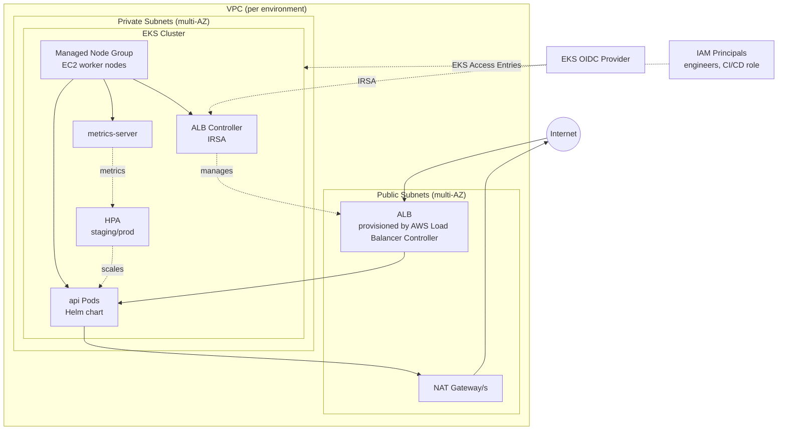

# Solution

## Architecture Overview



## Code Fixes

The original files contained bugs and security issues corrected before building the infrastructure around them.

### api/main.py

| Issue | Fix |
|-------|-----|
| `@app.on_event("startup")` deprecated in FastAPI 0.93+ | Replaced with `lifespan` context manager |
| `time.sleep(5)` silently blocks the event loop | Replaced with `await asyncio.sleep(5)` — see note below |
| `/ready` and `/alive` shared a single handler | Split into separate functions with distinct Kubernetes probe semantics |
| `/ready` always returned 200 regardless of startup state | Returns 503 until startup completes so Kubernetes withholds traffic |
| `f"Hello!"` — unnecessary f-string | Removed f-prefix |

> **Note on `time.sleep` in async context:** This bug does not cause a crash or an obvious error in simple local testing. `time.sleep(5)` runs successfully and the server starts normally after 5 seconds because the block happens at startup before any clients connect. The problem surfaces under real conditions: in Kubernetes, liveness and readiness probes fire during startup — while the event loop is frozen those HTTP requests never receive a response, causing the probe to time out and Kubernetes to restart the pod. Under concurrent load the blocked loop drops in-flight requests. If other async tasks (background jobs, DB connections) are scheduled alongside the sleep, they are starved and never run. `await asyncio.sleep(5)` yields control back to the event loop during the wait, so probes, concurrent requests, and other tasks continue to be served normally.

### Dockerfile

| Issue | Fix |
|-------|-----|
| `python:3.9.1-buster` — EOL base image | Updated to `python:3.12-slim` |
| `COPY . .` — copies `.git`, `.venv`, tests into image | Copy only `requirements.txt` then `api/` |
| Runs as root | Added dedicated non-root `appuser` |
| Port 80 — non-root processes cannot bind ports below 1024 | Changed to port 8000 |
| `pip install` without `--no-cache-dir` | Added flag to reduce image layer size |

### requirements.txt

All dependencies were outdated and several were incompatible with the updated FastAPI version. Updated to current stable versions compatible with FastAPI 0.115.5 and Python 3.12. Removed `asgiref` (Django dependency, not needed here), `PyYAML` (unused), and replaced `watchgod` with `watchfiles` (package was renamed in newer uvicorn).

---

## Integration Tests

`tests/test_api.py` contains four integration tests: the three endpoints and the readiness probe 503-before-startup behaviour. Run with:

```shell
pip install -r requirements-dev.txt
pytest tests/test_api.py -v
```

`requirements-dev.txt` adds `pytest` and `httpx` on top of `requirements.txt` so test dependencies stay out of the production image.

An empty `conftest.py` is required at the project root. Without it, pytest does not add the root directory to `sys.path` and `from api.main import app` fails with `ModuleNotFoundError`. The file has no content — its presence alone is enough to fix the import path.

---

## Part 1: Kubernetes Manifests

### Approach

Helm was chosen for its native reusability — a single chart with environment-specific values files covers all deployment targets without duplicating manifests.

### Chart Structure

```
helm/api/
├── Chart.yaml
├── values.yaml              # base defaults
├── values-dev.yaml
├── values-staging.yaml
├── values-prod.yaml
└── templates/
    ├── _helpers.tpl
    ├── deployment.yaml
    ├── service.yaml
    ├── ingress.yaml
    ├── hpa.yaml
    └── serviceaccount.yaml
```

### Key Decisions

**ALB Ingress Controller over NGINX**
Since the target cluster is EKS, the AWS Load Balancer Controller was chosen over NGINX ingress. It provisions a native ALB directly from the Ingress resource, integrating with AWS-native features (ACM, WAF, target group health checks) without an additional in-cluster proxy hop.

**Internal ALB for dev and staging, internet-facing for prod**
Dev and staging ALBs use `scheme: internal` — they are only reachable from within the VPC, meaning access requires a VPN connection. This prevents non-production environments from being exposed to the public internet. All three environments terminate TLS via an ACM certificate. Prod uses `scheme: internet-facing` and listens on both HTTP (redirected to HTTPS) and HTTPS 443. Dev and staging listen on HTTPS 443 only.

**Separate liveness and readiness probes**
`/alive` and `/ready` are split into separate handlers with distinct semantics. Liveness failure triggers a pod restart; readiness failure removes the pod from the service endpoint. Sharing one handler removes the ability to distinguish between "process is broken" and "not yet ready to serve traffic".

**Readiness returns 503 during startup**
`/ready` returns 503 until the `lifespan` startup completes. Kubernetes will not route traffic to the pod until the readiness probe passes, regardless of how quickly the container starts.

**HPA disabled in dev, enabled in staging and prod**
Horizontal pod autoscaling requires metrics-server and is only meaningful under real load. Dev runs a fixed single replica to keep resource usage low.

**Pod and container security context**
All pods run as a non-root user (`runAsUser: 1000`), with `allowPrivilegeEscalation: false`, `readOnlyRootFilesystem: true`, and all Linux capabilities dropped. This matches the non-root `appuser` configured in the Dockerfile.

**Rolling update with `maxUnavailable: 0`**
Zero downtime deployments — new pods must pass their readiness probe before old ones are terminated.

### Environment Differences

| Setting | dev | staging | prod |
|---------|-----|---------|------|
| Replicas | 1 (fixed) | 2 (HPA min) | 3 (HPA min) |
| HPA max | — | 5 | 10 |
| CPU target | — | 70% | 60% |
| ALB scheme | internal (VPN only) | internal (VPN only) | internet-facing |
| TLS | ACM certificate | ACM certificate | ACM certificate |
| HTTP→HTTPS redirect | no | no | yes |
| Image pull | Always | IfNotPresent | IfNotPresent |

### Deploy Commands

```shell
helm upgrade --install api ./helm/api -f helm/api/values-dev.yaml
helm upgrade --install api ./helm/api -f helm/api/values-staging.yaml
helm upgrade --install api ./helm/api -f helm/api/values-prod.yaml
```

---

## Part 2: Terraform Configuration

### Approach

Three reusable modules called from per-environment directories. Each environment directory contains only `locals.tf` (all config values), `provider.tf`, `backend.tf`, and an identical `main.tf`. No `variables.tf` or `terraform.tfvars` — all values are static locals, making the configuration explicit and avoiding accidental CLI overrides.

### Module Structure

```
terraform/
├── modules/
│   ├── vpc/              # VPC, subnets, IGW, NAT gateways, route tables
│   ├── eks/              # EKS cluster, node groups, IAM roles, OIDC, add-ons
│   └── alb-controller/  # IRSA role, IAM policy, Helm release
└── envs/
    ├── dev/
    ├── staging/
    └── prod/
```

See `terraform/modules/*/README.md` for each module's inputs, outputs, and usage.

### Key Decisions

**Custom modules over `terraform-aws-modules/eks`**
Custom modules were written to demonstrate understanding of the underlying AWS resources. In production, `terraform-aws-modules/eks` would be preferred — it is battle-tested, handles edge cases (access entries, Fargate, managed add-ons lifecycle), and is actively maintained.

**`for_each` over `count` for subnet resources**
Subnets, NAT gateways, and route tables are keyed by AZ name rather than index. Adding or removing an AZ only affects that specific resource — no cascading destroy/recreate of all subnets due to index shifts.

**Subnet config as list of objects**
Instead of three parallel lists (`azs`, `public_subnet_cidrs`, `private_subnet_cidrs`), each subnet is a self-contained object `{ az, cidr }`. All configuration for a subnet is co-located and the lists cannot fall out of sync.

**Single NAT gateway in dev/staging, one per AZ in prod**
A single NAT gateway saves cost in non-production environments. In production, one per AZ ensures traffic stays within its AZ, eliminates cross-AZ data transfer charges, and removes the single point of failure.

**IRSA for ALB controller**
The ALB controller authenticates to AWS via IRSA (IAM Roles for Service Accounts) rather than node-level instance profiles. Only the controller's specific service account can assume the ALB IAM role — not every pod running on the node.

**EKS managed add-ons with pinned versions**
`coredns`, `kube-proxy`, and `vpc-cni` are managed as `aws_eks_addon` resources with explicit version pins. This prevents silent upgrades during EKS control plane updates and makes version changes a deliberate Terraform commit.

**metrics-server included in EKS module**
The HPA resources in the Helm chart depend on metrics-server. Without it, HPA cannot function and reports `<unknown>` for current CPU utilisation.

**EKS Access Entries for cluster access control**
The cluster uses `authentication_mode = "API"` (introduced in EKS 1.28), replacing the legacy `aws-auth` ConfigMap with Access Entries. Each IAM principal (engineer role, CI/CD deploy role) is mapped to a specific EKS access policy — `AmazonEKSClusterAdminPolicy` for admins, `AmazonEKSEditPolicy` for CI/CD. This is auditable, IAM-native, and eliminates ConfigMap drift. Placeholder ARNs in `locals.tf` must be replaced with real roles before applying.

**Security group management**
Cluster-to-node security is handled by the EKS-managed cluster security group, automatically attached to both control plane and managed node groups. ALB-to-pod traffic (`target-type: ip`) is managed automatically by the AWS Load Balancer Controller — it creates an ALB security group and dynamically manages inbound rules on node security groups as pods register and deregister. This works correctly because the ALB controller IAM policy includes `ec2:AuthorizeSecurityGroupIngress/Revoke`, and the VPC module tags subnets with `kubernetes.io/role/elb` and `kubernetes.io/role/internal-elb` for ALB subnet discovery.

**Node AMI**
Node groups use `ami_type = "AL2023_x86_64_STANDARD"` (Amazon Linux 2023 — AL2 reached end of standard support in June 2025 and is not supported on EKS 1.33+). No specific AMI ID is pinned by default. To pin a release, set `release_version` in the node group config in `locals.tf` (e.g. `"1.33.0-20250501"`). To pin by explicit AMI ID, add a launch template with `image_id` set.

### Environment Differences

| Setting | dev | staging | prod |
|---------|-----|---------|------|
| Node type | t3.medium | t3.medium | t3.large |
| Node count | 1–2 | 2–4 | 3–6 |
| NAT gateways | 1 (shared) | 1 (shared) | 3 (one per AZ) |
| VPC CIDR | 10.0.0.0/16 | 10.1.0.0/16 | 10.2.0.0/16 |

### Deploy Commands

```shell
cd terraform/envs/dev
terraform init
terraform plan
terraform apply
```

After apply, configure kubectl:
```shell
aws eks update-kubeconfig --region eu-central-1 --name example-dev
```

---

## Assumptions

- **Region:** `eu-central-1` — example.markets operates in Europe.
- **Container registry:** The Helm chart uses `image.repository` and `image.tag` as placeholders. A real deployment would push the Docker image to ECR and reference it here.
- **ACM certificates:** All three environment values files contain placeholder ARNs. Each environment requires its own ACM certificate — internal certificates for dev/staging (covering `api.dev.example.com`, `api.staging.example.com`) and a public certificate for prod (`api.example.com`). Replace the placeholders before deploying.
- **VPN:** Dev and staging ALBs are internal — a VPN or Direct Connect into the VPC is required to reach them. VPN setup is outside the scope of this exercise.
- **S3 backend:** The backend is commented out in `backend.tf`. An S3 bucket and DynamoDB table for state locking must be created and the block uncommented before use.
- **AWS credentials:** Deployment requires AWS credentials with sufficient permissions across EKS, EC2, IAM, and ELB.

---

## What I Would Add for Full Production Readiness

### Terraform GitOps Pipeline

A GitHub Actions workflow per environment handles infrastructure changes with a mandatory review gate before any apply.

**On pull request:**
1. `terraform fmt -check` and `terraform validate`
2. `terraform plan` — output posted as a PR comment
3. PR requires approval from a second engineer before merge

**On merge to `main`:**
1. `terraform apply` runs against the target environment
2. Apply is gated behind a GitHub Actions environment protection rule requiring manual approval for staging and prod
3. State is stored in S3 with DynamoDB locking — concurrent applies are blocked
4. AWS credentials are never stored in CI — each environment uses a dedicated IAM role assumed via GitHub's OIDC provider

```
.github/workflows/
├── ci.yml                  # test + build + push on every merge to main
├── terraform-dev.yml       # auto-apply on merge, no approval required
├── terraform-staging.yml   # plan on PR, apply requires 1 approval
└── terraform-prod.yml      # plan on PR, apply requires 2 approvals
```

---

### Application CI/CD Pipeline

A separate workflow handles the application image lifecycle independently of infrastructure changes.

**On pull request:**
1. `pip install -r requirements-dev.txt && pytest tests/ -v` — integration test suite must pass
2. `docker build` — verifies the image builds cleanly without pushing

**On merge to `main`:**
1. Tests run again on the merge commit
2. Docker image is built and tagged with the short git SHA (`${{ github.sha }}`)
3. Image is pushed to ECR — AWS credentials are never stored in CI, the workflow assumes a dedicated IAM role via GitHub's OIDC provider
4. The Helm values file for the target environment is updated in-repo with the new `image.tag`, which ArgoCD picks up automatically on its next sync

```yaml
# .github/workflows/ci.yml (abbreviated)
jobs:
  test:
    runs-on: ubuntu-latest
    steps:
      - uses: actions/checkout@v4
      - uses: actions/setup-python@v5
        with: { python-version: "3.12" }
      - run: pip install -r requirements-dev.txt
      - run: pytest tests/ -v

  build-push:
    needs: test
    if: github.ref == 'refs/heads/main'
    runs-on: ubuntu-latest
    permissions:
      id-token: write   # required for OIDC
      contents: read
    steps:
      - uses: actions/checkout@v4
      - uses: aws-actions/configure-aws-credentials@v4
        with:
          role-to-assume: arn:aws:iam::ACCOUNT_ID:role/github-actions-ecr
          aws-region: eu-central-1
      - uses: aws-actions/amazon-ecr-login@v2
      - uses: docker/setup-buildx-action@v3
      - run: |
          IMAGE=ACCOUNT_ID.dkr.ecr.eu-central-1.amazonaws.com/api:${{ github.sha }}
          docker buildx build \
            --platform linux/amd64,linux/arm64 \
            --tag $IMAGE \
            --push \
            .
```

**Image tagging strategy:**
- Every merge to `main` produces an immutable image tagged with the git SHA
- No `latest` tag in production — every deployment is traceable to an exact commit
- ECR lifecycle policy retains the last 30 images and deletes untagged layers older than 7 days

---

### ArgoCD — App of Apps

ArgoCD is deployed on each EKS cluster (via Terraform `helm_release`) — one instance per environment. Each cluster manages only its own workloads.

A root Application is bootstrapped once per cluster (via Terraform or `kubectl apply`). It points to the environment-specific apps directory in the repo. ArgoCD reconciles the root app, which creates and reconciles all child Application resources in that directory. Adding a new service to a cluster is a single Git commit — no manual `helm install` or `kubectl apply` needed.

**Directory layout:**

```
argocd/
├── root-app.yaml           # bootstrapped once per cluster; path differs per env
└── apps/
    ├── dev/
    │   └── api.yaml        # Application manifest — deployed on dev cluster
    ├── staging/
    │   └── api.yaml        # Application manifest — deployed on staging cluster
    └── prod/
        └── api.yaml        # Application manifest — deployed on prod cluster
```

**Root app** (bootstrapped on each cluster, `path` is the only field that differs):

```yaml
apiVersion: argoproj.io/v1alpha1
kind: Application
metadata:
  name: root-app
  namespace: argocd
spec:
  project: default
  source:
    repoURL: https://github.com/org/repo
    targetRevision: main
    path: argocd/apps/dev          # argocd/apps/staging or argocd/apps/prod on other clusters
  destination:
    server: https://kubernetes.default.svc
    namespace: argocd
  syncPolicy:
    automated:
      prune: true
      selfHeal: true
```

**Child app** (e.g. `argocd/apps/prod/api.yaml`):

```yaml
apiVersion: argoproj.io/v1alpha1
kind: Application
metadata:
  name: api
  namespace: argocd
spec:
  project: default
  source:
    repoURL: https://github.com/org/repo
    targetRevision: main
    path: helm/api
    helm:
      valueFiles:
        - values-prod.yaml
  destination:
    server: https://kubernetes.default.svc
    namespace: api
  syncPolicy:
    automated:
      prune: true
      selfHeal: true
    syncOptions:
      - CreateNamespace=true
```

**Sync strategy per environment:**

| Environment | Sync | Self-heal | Prune | Gate |
|-------------|------|-----------|-------|------|
| dev | Automated | yes | yes | none |
| staging | Automated | yes | yes | none |
| prod | Manual | yes | yes | approval in ArgoCD UI |

Production syncs require a manual trigger in the ArgoCD UI or `argocd app sync api`, providing a human gate before any change reaches production.

---

### Additional Components

- **External DNS** — Automatically creates Route53 records pointing to the ALB based on Ingress hostnames, eliminating manual DNS management.
- **Cluster Autoscaler or Karpenter** — Scales EC2 nodes based on pending pod demand. HPA scales pods; the cluster autoscaler scales the nodes underneath them.
- **ACM + Route53 as Terraform resources** — Provision the certificate and DNS record in Terraform and pass the ARN directly into the Helm values via output, removing the placeholder.
- **ECR repository** — Terraform-managed ECR with lifecycle policies, referenced by the Helm chart via Terraform output.
- **`terraform-aws-modules/eks`** — Replace the custom EKS module with the community module for better edge case coverage and ongoing maintenance.
- **Network policies** — Restrict pod-to-pod traffic within the cluster using Kubernetes NetworkPolicy resources.
- **Pod Disruption Budgets** — Ensure a minimum number of replicas remain available during node maintenance or rolling upgrades.
- **AWS Secrets Manager + External Secrets Operator** — Manage any future application secrets outside the cluster and sync them into Kubernetes Secrets automatically.
- **Centralised logging** — Deploy a log shipping agent as a DaemonSet on each cluster to collect stdout/stderr from all pods and forward to a centralised log store. Since the app already logs to stdout (K8s recommended pattern), no application changes are needed — only the agent deployment. Common options: **Fluent Bit** (lightweight, recommended for EKS — available as an EKS managed add-on via `aws_eks_addon`) forwarding to CloudWatch Logs or OpenSearch; or **Datadog/Datadog Agent** if the wider observability stack is Datadog. The agent should be deployed via Terraform `helm_release` or the EKS managed add-on, with per-environment log group naming and appropriate IAM permissions via IRSA.
