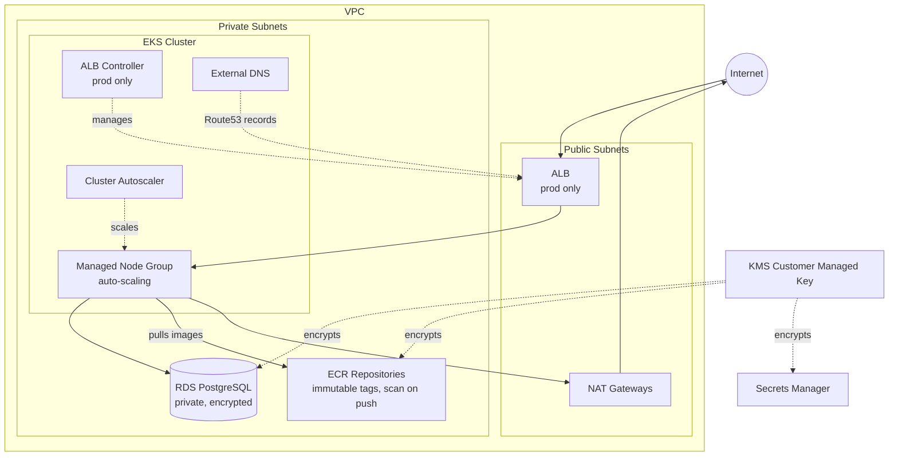

# AWS CDK Infrastructure

A modular AWS CDK (TypeScript) project that provisions a production-ready EKS-based platform. Each AWS service is encapsulated in its own reusable construct module and toggled per environment via a typed configuration object.

---

## Architecture



---

## Modules

| Module | File | Description |
|---|---|---|
| VPC | `lib/modules/vpc-module.ts` | VPC with configurable CIDR, AZs, NAT gateways, public/private subnets |
| EKS | `lib/modules/eks-module.ts` | EKS cluster with managed node group, IRSA-ready, configurable endpoint access |
| ALB Controller | `lib/modules/alb-controller-module.ts` | AWS Load Balancer Controller via Helm, custom IAM policy, pinned chart version |
| KMS | `lib/modules/kms-module.ts` | Customer-managed KMS key with automatic rotation shared across services |
| ECR | `lib/modules/ecr-module.ts` | ECR repositories with immutable tags, scan-on-push, KMS encryption, lifecycle policy |
| RDS | `lib/modules/rds-module.ts` | PostgreSQL 16 in private subnets, credentials in Secrets Manager, KMS encrypted |
| External DNS | `lib/modules/external-dns-module.ts` | External DNS controller via Helm with IRSA and Route53 permissions |
| Cluster Autoscaler | `lib/modules/cluster-autoscaler-module.ts` | Cluster Autoscaler via Helm with IRSA and scoped ASG permissions |

---

## Environment Configuration

Environments are configured in `lib/env/` and selected at deploy time via the `env` CDK context variable.

| Setting | dev | prod |
|---|---|---|
| VPC CIDR | `10.10.0.0/16` | `10.20.0.0/16` |
| Availability Zones | 2 | 3 |
| NAT Gateways | 1 | 3 (one per AZ) |
| EKS endpoint | Public + Private | Private only |
| Node group | min 1 / max 2 | min 2 / max 6 |
| ALB Controller | disabled | enabled |
| RDS instance | `db.t3.medium`, no MultiAZ | `db.t3.large`, MultiAZ |
| RDS backup | 1 day | 7 days |
| RDS deletion protection | no | yes |
| Domain filter | `dev.example.com` | `example.com` |

To add a new environment, create `lib/env/<name>/index.ts` implementing `EnvironmentConfig` and extend the selector in `bin/aws_cdk_infra.ts` and `lib/aws_cdk_infra-stack.ts`.

---

## Prerequisites

- Node.js 18+
- AWS CLI configured (`aws configure`)
- CDK CLI: `npm install -g aws-cdk`
- CDK bootstrapped in target account/region:
  ```bash
  cdk bootstrap aws://<ACCOUNT_ID>/<REGION>
  ```

---

## Getting Started

```bash
npm install
npm run build
npm test
```

---

## Deployment

All commands default to the **dev** environment. Pass `--context env=prod` for production.

```bash
# Preview changes
npx cdk diff
npx cdk diff --context env=prod

# Synthesize CloudFormation template
npx cdk synth
npx cdk synth --context env=prod

# Deploy
npx cdk deploy
npx cdk deploy --context env=prod

# Destroy (dev only — prod has deletion protection)
npx cdk destroy
```

The target account and region are read from `CDK_DEFAULT_ACCOUNT` and `CDK_DEFAULT_REGION`, which the CDK CLI sets automatically from your AWS profile.

---

## Stack Outputs

After a successful deploy the following outputs are available in CloudFormation (and printed to the terminal):

| Output | Description |
|---|---|
| `VpcId` | VPC identifier |
| `EksClusterName` | EKS cluster name |
| `EcrRepoUriApp` | ECR URI for the `app` image |
| `EcrRepoUriWorker` | ECR URI for the `worker` image |
| `RdsEndpoint` | RDS instance hostname |
| `RdsSecretArn` | Secrets Manager ARN for DB credentials |

---

## Project Structure

```
bin/
└── aws_cdk_infra.ts          # Entry point — resolves env config, creates stack

lib/
├── aws_cdk_infra-stack.ts    # Main stack — composes modules conditionally
├── env/
│   ├── types.ts              # Shared EnvironmentConfig interface
│   ├── dev/index.ts          # Dev environment values
│   └── prod/index.ts         # Prod environment values
├── modules/
│   ├── vpc-module.ts
│   ├── eks-module.ts
│   ├── alb-controller-module.ts
│   ├── kms-module.ts
│   ├── ecr-module.ts
│   ├── rds-module.ts
│   ├── external-dns-module.ts
│   └── cluster-autoscaler-module.ts
└── policies/
    └── alb-controller-iam-policy.json   # Official AWS LBC IAM policy

test/
└── aws_cdk_infra.test.ts     # CDK assertion tests (38 tests, dev + prod)
```

---

## Development

```bash
npm run build    # Compile TypeScript
npm run watch    # Watch mode
npm test         # Run CDK assertion tests
```
