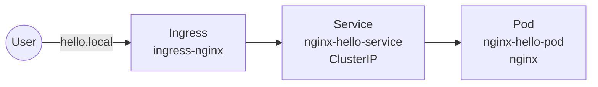

# Simple App Demo

Minimal Kubernetes demo: an Nginx pod exposed via a ClusterIP service and an Nginx ingress.

## Architecture



## Manifests
- `pod.yaml` — `nginx-hello-pod` running `sibindocker/images:nginxdemo`
- `service.yaml` — `nginx-hello-service`, ClusterIP, routes port 80 to the pod
- `ingress.yaml` — routes `hello.local` to the service via `ingress-nginx`

## Deploy
```bash
kubectl apply -f pod.yaml -f service.yaml -f ingress.yaml
```
